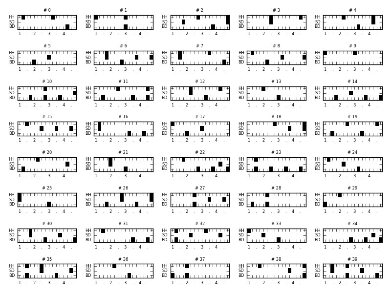

# Drum-Groove extraction

We did a hackday at IDMT yesterday. This is what I did so far ...

## Steps

### Exploration

- write a wrapper for pyguitarpro to parse a collection of > 50,000 Guitar Pro files (gp3, gp4, gp5)
- extract subpatterns of 1 bar length
- quantize to 16th note grid
- focus on songs in 4/4 time signature
- map drum instruments to 3 classes
  1. hi-hat / cymbals
  2. snare drum
  3. bass drum
- convert each bass loop (3 x 16 bits) into int64 integer
- parse all songs and collect patterns that occur more than once
- in total we have 8,8 mio bars so far (that's not all!)

- Some weird patterns (16th note sequences)
- Proof-of-concept as we observe many cliché patterns (also as shifted versions)
- patterns need at least 8 notes (all others are filtered out beforehand)

### Generation

- take first 10,000 bars
- train Recurrent Neural Network (very simple, one LSTM layer, 256 units) to predict current bar of drum track from previous 10 bars
- here's a sequence of prediction (still not very interesting but something is happening ;)

### Future steps / ideas

- t-SNE visualization of patterns connected with audio playback (like this here:
https://experiments.withgoogle.com/ai/drum-machine)
- train a DC-GAN for generation (this should also cope with the cyclic shifts in the patterns)
- encode bass track as well
  - harmony estimation per bar from other instrument tracks
  - encode pitches as chordal diatonic pitch class
- use different grid that includes triple tatums (e.g. 48)
- or: estimate local tatum per beat (like Frieler's Flex-Q algorithm)
- improve RNN
  - check word-2-vec (Karpathy)
  - check negative sampling
- use embeddings to avoid one-hot-encoding with > 1000 classes

